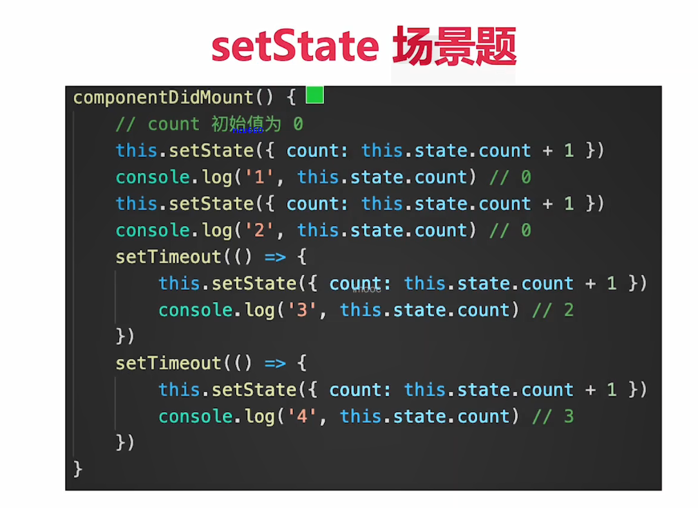

# React

## React 基本使用

### React 面试题举例

1. React 组件如何通信
2. JSX 本质是什么
3. context 是什么。有和用途？
4. shouldComponentUpdate 的用途
5. 描述 redux 单项数据流
6. setState 是同步还是异步？(如下场景题)

```
class Root extends React.Component {
  constructor(props){
    super(props)
    this.state = {count:0}
  }
  componentDidMount(){
    this.setState({count:this.state.count + 1})
    console.log(this.state.count)   // 打印
    this.setState({count:this.state.count + 1})
    console.log(this.state.count)   // 打印
    setTimeout(function(){
      this.setState({count:this.state.count + 1})
      console.log(this.state.count)   // 打印
    })
    setTimeout(function(){
      this.setState({count:this.state.count + 1})
      console.log(this.state.count)   // 打印
    },0)
  }
  render() {
    return <h1>{this.state.count}</h1>
  }
}
```

### JSX 基本使用

- 变量、表达式
- class style
- 子元素和组件

### 条件判断

- if else
- 三元表达式
- 逻辑运算符 && ||

### 渲染列表

- map
- key (_不能是 index 或 random_)

### 事件

- bind this
- 关于 event 参数
  - `event.target` is the element that triggered the event (e.g., the user clicked on)
  - `event.currentTarget` is the element that the event listener is attached to.
  - react event 是 SyntheticEvent，模拟出来 DOM 事件所有能力
  - event.nativeEvent 是原生事件对象
  - 所有的事件，都被挂载到 document 上
  - 和 DOM 事件不一样，和 Vue 事件也不一样
- 传递自定义参数
  - 最后追加一个参数，即可接受 event

### 表单

- 受控组件 （_组件的值由 state 控制的_）
  - input textarea select 用 value
  - checkbox radio 用 checked

### 组件使用

- props 传递数据
- props 传递函数
- props 类型检查 （_prop-types 包_）

### setState（重点）

- 不可变值（函数式编程，纯函数）
  - 不要直接修改 state，使用不可变值
- 可能是异步更新

  ```
  // setState 可能是异步更新（有可能是同步更新）
  this.setState(
    {
      count: this.state.count + 1,
    },
    () => {
      // 联想 Vue $nextTick - DOM
      console.log("count by callback", this.state.count); // 回调函数中可以拿到最新的 state
    }
  );
  console.log("count", this.state.count); // 异步的，拿不到最新值

  // setTimeout 中 setState 是同步的
  setTimeout(() => {
    this.setState({
      count: this.state.count + 1,
    });
    console.log("count in setTimeout", this.state.count);
  }, 0);
  // 自己定义的 DOM 事件，setState 是同步的。在 componentDidMount 中
  ```

  ```
    // 第四，state 异步更新的话，更新前会被合并
    // // 传入对象，会被合并（类似 Object.assign ）。执行结果只一次 +1
    // this.setState({
    //     count: this.state.count + 1
    // })
    // this.setState({
    //     count: this.state.count + 1
    // })
    // this.setState({
    //     count: this.state.count + 1
    // })

    // 传入函数，不会被合并。执行结果是 +3
    this.setState((prevState, props) => {
      return {
        count: prevState.count + 1,
      };
    });
    this.setState((prevState, props) => {
      return {
        count: prevState.count + 1,
      };
    });
    this.setState((prevState, props) => {
      return {
        count: prevState.count + 1,
      };
    });
  ```

- 可能会被合并

### 组件生命周期

- 单组件生命周期
- 父子组件生命周期，和 Vue 一样

## React 高级特性

### 函数组件

### 非受控组件

- ref
- defaultValue
- defaultChecked
- 手动操作 DOM 元素
- 非受控组件使用场景
  - 必须手动操作 DOM 元素，setState 实现不了
  - 文件上传`<input type=file>`
  - 某些富文本编辑器，需要传入 DOM 元素
- 受控组件 VS 非受控组件
  - 优先使用受控组件，符合 React 设计原则
  - 必须操作 DOM 时，再使用非受控组件

### Portals

- 组件默认会按照既定层次嵌套渲染
- 如何让组件渲染到父组件以外？

```
    // 使用 Portals 渲染到 body 上。
    // fixed 元素要放在 body 上，有更好的浏览器兼容性。
    return ReactDOM.createPortal(
      <div className="modal">{this.props.children}</div>,
      document.body // DOM 节点
    );
```

- Portals 使用场景
  - overflow：hidden
  - 父组件 z-index 值太小
  - fixed 需要放在 body 第一层级

### context

- 公共信息（语言、主题）如何传递给每个组件？
- 用 props 太繁琐
- 用 redux 小题大做

### 异步组件

- import()
- React.lazy
- React.Suspense

### 性能优化

- shouldComponentUpdate(SCU)
  - SCU 默认返回 True，即 React 默认重新渲染所有子组件
  - 必须配合“不可变值”一起使用
  - React 默认：父组件有更新，子组件则无条件也要更新
  - SCU 一定每次都要用吗？—— 需要的时候才优化，即可先不用 SCU，有性能问题时在考虑使用
- PureComponent and React.memo
  - PureComponent， SCU 中实现了浅比较
  - memo，函数组件中的 PureComponent
  - 浅比较已适用大部分情况（尽量不要做深度比较）
- 不可变值 immutable.js
  - 彻底拥抱“不可变值”
  - 基于共享数据（不是深拷贝），速度好
  - 有一定的学习和迁移成本，按需使用

### 高阶组件 HOC 和 Render Props

- 关于组件公共逻辑的抽离
  - mixin，已被 React 弃用
  - HOC
  - Render Props
- HOC vs Render Props
  - HOC：模式简单，但会增加组件层级
  - Render Props：代码简介，学习成本较高
  - 按需使用

### Redux 使用

- 基本概念
- 单项数据流
  - dispatch(action)
  - reducer -> newState
  - subscribe 触发通知
    
- react-redux
  - Provider
  - connect
  - mapStateToProps mapDispatchToProps
- 异步 action
  - redux-thunk
  - redux-promise
  - redux-saga
    
- 中间件
  

### React-router

- React-router 使用
  - 路由模式（hash、H5 history）
  - 路由配置（动态路由、懒加载）
- React-router 路由模式
  - hash 模式（默认）
  - H5 history 模式， 需要 server 端支持，因此无特殊需求可选择前者

## React 原理

### 函数式编程

- 一种编程范式，概念比较多
- 纯函数
- 不可变值

### vdom 和 diff

- vdom
  - h 函数
  - vnode 数据结构
  - patch 函数

```
{
  tag:'div',
  props:{
    className:'container',
    id:'div1'
  },
  children:[
    {
      tag:'p',
      children:'vdom'
    }
  ]
}
```

- diff
  - 只比较同一层及，不跨级比较
  - tag 不相同，则直接删除重建，不再深度比较
  - tag 和 key， 两者都相同，则认为是相同节点，不再深度比较

### JSX 本质

- JSX 等同于 Vue 模板，Vue 模板不是 html，JSX 也不是 JS
- React.createElement 即 h 函数，返回 vnode
  - 第一个参数可能是组件，也可能是 html tag
  - 组件名，首字母必须大写（React 规定）

### 合成事件

- 所有事件挂载到 document 上
- event 不是原生额，是 SyntheticEvent 合成事件对象
- 和 Vue 事件不同，和 DOM 事件也不同
  
- 为什么要合成事件机制？
  - 更好的兼容性和跨平台
  - 挂载到 document， 减少内存消耗，避免频繁解绑
  - 方便事件的统一管理（如事务机制）

### setState batchUpdate

- setState
  - 有时异步（普通使用），有时同步（setTimeout、DOM 事件）
  - 有时合并（对象形式），有时不合并（函数形式）
- 核心要点

  - setState 主流程
    
  - batchUpdate 机制
    
  - transaction（事务）机制
    
    

- setState 异步还是同步
  - setState 无所谓异步还是同步
  - 看是否能命中 batchUpdate 机制
  - 判断 isBatchingUpdates
- 哪些能命中 batchUpdate 机制
  - 生命周期（和他调用的函数）
  - React 中注册的事件（和他调用的函数）
  - React 可以“管理”的入口
- 哪些不能命中 batchUpdate 机制
  - setTimeout setInterval 等（和他调用的函数）
  - 自定义的 DOM 事件（和他调用的函数）
  - React“管不到”的入口

### 组件渲染过程

- 组件渲染和更新过程
  - 组件渲染过程
    1. props state
    2. render()生成 vnode
    3. patch(elem, vnode)
  - 组件更新过程
    1. setState(newState) --> dirtyComponents(可能有子组件)
    2. render()生成 newVnode
    3. patch(vnode,newVnode)
- React fiber
  - 更新的两个阶段
    1. reconciliation 阶段-执行 diff 算法，纯 JS 计算
    2. commit 阶段-将 diff 结果渲染 DOM
  - 可能会有性能问题
    - JS 是单线程，且和 DOM 渲染共用一个线程
    - 当组件足够复杂，组件更新时计算和渲染都压力大
    - 同时再有 DOM 操作需求（动画，鼠标拖拽等），将卡顿
  - 解决方案 fiber
    - 将 reconciliation 阶段进行任务拆分（commit 无法拆分）
    - DOM 需要渲染是暂停，空闲时恢复
    - window.requestIdleCallback

## React 面试真题演练

- 组件之间如何通讯？
  - 父子组件 props
  - 自定义事件
  - Redux 和 Context
- JSX 本质是什么
  - createElement
  - 执行返回 vnode
- Context 是什么？如何应用？
  - 父组件，向其下所有子孙组件传递信息
  - 如一些简单的公共信息：主题色、语言等
  - 复杂的公共信息，请用 redux
- shouldComponentUpdate 用途
  - 性能优化
  - 配合“不可变值”一起使用，否则会出错
- redux 单项数据流图
- setState 场景题
  
- 什么是纯函数
  - 返回一个新值，没有副作用（不会“偷偷”修改其他值）
  - 重点：不可变值
  - 如 arr1 = arr.slice()
- React 组件生命周期
  - 单组件生命周期
  - 父子组件生命周期
  - 主要 SCU
- React 发起 ajax 应该在哪个生命周期
  - 同 Vue
  - componentDidMount
- 渲染列表，为何使用 key
  - 同 Vue。必须使用 key，且不能是 index 和 random
  - diff 算法中通过 tag 和 key 来判断，是否是 sameNode
  - 减少渲染次数，提升渲染性能
- 函数组件和 class 组件的区别
  - 纯函数，输入 props，输出 JSX
  - 没有实例，没有生命周期，没有 state
  - 不能扩展其他方法
- 什么是受控组件？
  - 表单的值，受 state 控制
  - 需要自行监听 onChange、更新 state
  - 对比非受控组件
- 何时使用异步组件
  - 同 Vue
  - 加载大组件
  - 路由懒加载
- 多个组件有公共逻辑，如何抽离
  - HOC
  - Render Props
  - mixin （已被 React 废弃）
- redux 如何进行异步请求
  - 使用异步 action
  - 如 redux-thunk
- react-router 如何配置懒加载
  
- PureComponent 有何区别
  - 实现了浅比较的 shouldComponentUpdate
  - 优化性能，但要结合不可变值使用
- React 事件和 DOM 事件的区别
  - 所有事件挂载到 document 上
  - event 不是原生的，是 SyntheticEvent 合成事件对象
  - dispatchEvent
- React 性能优化
  - 渲染列表时加 key
  - 自定义事件、DOM 事件及时销毁
  - 合理使用异步组件
  - 减少函数 bind this 的次数
  - 合理使用 SCU PureComponent 和 memo
  - 合理使用 Immutable.js
  - 使用 SSR
- React 和 Vue 的区别
  - same：
    - 都支持组件化
    - 都是数据驱动视图
    - 都使用 vdom 操作 DOM
  - different：
    - React 使用 JSX 拥抱 JS，Vue 使用模板拥抱 html
    - React 函数式编程，Vue 声明式编程
    - React 更多需要自力更生，Vue 把想要的都给你

## React Hooks

- class 组件的问题
  - 大型组件很难拆分和重构，很难测试（即 class 不易拆分）
  - 相同业务逻辑，分散到各个方法中，逻辑混乱
  - 复用逻辑变得复杂，如 HOC、Render Props、Mixin
- React 组件更易用函数表达
  - React 提倡函数式编程，view = fn(props)
  - 函数更灵活，更易拆分，更易测试
  - 但函数组件太简单，需要增强能力——Hooks
- 让函数组件实现 state 和 setState
  - 默认函数组件没有 state
  - 函数组件是一个纯函数，执行完即销毁，无法存储 state
  - 需要 State Hook，即把 state 功能“钩”到纯函数中
- Effect Hook
  - 让函数组件模拟声明周期
    - 默认函数组件没有生命周期
    - 函数组件是一个纯函数，执行完即销毁，自己无法实现生命周期
    - 使用 Effect Hook 把生命周期 “钩” 到纯函数中
  - useEffect 使用总结
    - 模拟 componentDidMount - useEffect 依赖 []
    - 模拟 componentDidUpdate - useEffect 无依赖，或者依赖[a,b]
    - 模拟 componentWillUnMount - useEffect 中返回一个函数
  - useEffect 让纯函数有了副作用
    - 默认情况下，执行纯函数，输入参数，返回结果，无副作用
    - 所谓副作用，就是对函数之外造成影响，如设置全局定时任务
    - 而组件需要副作用，所以需要 useEffect “钩” 到纯函数中
  - useEffect 中返回函数 fn
    - useEffect 依赖[]，组件销毁时执行 fn，等于 WillUnMount
    - useEffect 无依赖或者依赖[a,b]，组件更新时执行 fn
    - 即，下一次执行 useEffect 之前，就会执行 fn，无论更新或者卸载
  - useState 和 useEffect 小结
    - 函数组件更适合 React 组件，但需要 Hooks 增强功能
    - useState 可实现 state 和 setState
    - useEffect 可模拟组件主要的生命周期
- other Hooks
  - useRef
  - useContext
  - useReducer
    - useReducer 和 redux 的区别
      - useReducer 是 useState 的代替方案，用于 state 复杂变化
      - useReducer 是单个组件状态管理，组件通讯还需要 props
      - redux 是全局的状态管理，多组件共享数据
  - useMemo（用于缓存数据）
    - useMemo 使用总结
      - React 默认会更新所有子组件
      - class 组件使用 SCU 和 PureComponent 做优化
      - Hooks 中使用 useMemo，但优化的原理是相同的
  - useCallback（用于缓存函数）
- 自定义 Hook
  - 本质是一个函数，以 use 开头（重要）
  - 内部正常使用 useState useEffect 或者其他 Hooks
  - 自定义返回结果，格式不限
  - 封装通用的功能
  - 开发和使用第三方 Hooks
  - 自定义 Hook 带来了无线的扩展性，解耦代码
- Hooks 使用规范
  - 命名规范 useXxx
  - 关于 Hooks 的调用顺序
  - 只能用于 React 函数组件和自定义 Hook 中，其他地方不可以
  - 只能用于顶层代码，不能在循环、判断中使用 Hooks
  - eslint 插件 eslint-plugin-react-hooks 可以帮助到你
- Hooks 调用顺序必须保持一致
  - 无论是 render(组件初始化) 还是 re-render(组件更新)，Hooks 调用顺序必须一致
  - 如果 Hooks 出现在循环、判断里，则无法保证顺序一致
  - Hooks 严重依赖于调用顺序！重要！
- class 组件的一些问题
  - Mixin 的问题
    - 变量作用域来源不清
    - 属性重名
    - Mixin 引入过多会导致顺序冲突
  - HOC
    - 组件层级嵌套过多，不易渲染，不易调试
    - HOC 会劫持 props，必须严格规范，容易出现疏漏
  - Render Prop
    - 学习成本高，不易理解
    - 只能传递纯函数，而默认情况下纯函数功能有限
- Hooks 做组件逻辑复用的好处
  - 完全符合 Hooks 原有规则，没有其他要求，易理解记忆
  - 变量作用域明确
  - 不会产生组件嵌套
- React Hooks 主要事项
  - useState 初始化值，只有第一次有效（只能通过 setXxx 修改）
  - useEffect 内部不能修改 state
  - useEffect 可能出现死循环（依赖里有{},[]引用类型）
- Hooks 面试题
  - 为什么会有 React Hooks，他解决了哪些问题？
    1. 完善函数组件的能力，函数更适合 React 组件
    2. 组件逻辑复用，Hooks 表现更好
    3. class 复杂组件正变的费解，不易拆解，不易测试，逻辑混乱
    4. class 组件中，相同的逻辑散落在各处
       - DidMount 和 DidUpdate 中获取数据
       - DidMount 绑定事件，WillUnMount 解绑事件
       - 使用 Hooks，相同的逻辑可分割到一个一个的 useEffect 中
  - React Hooks 如何模拟组件生命周期？（_见上述 Effect Hook 小节_）
  - 如何自定义 Hook？
  - React Hooks 性能优化（_见上述 useMemo 小节_）
  - 使用 React Hooks 遇到哪些坑？（_见上述 React Hooks 主要事项 小节_）
  - Hooks 相比 HOC 和 Render Prop 有哪些优点？ （_见上述 React Hooks 主要事项 小节_）
