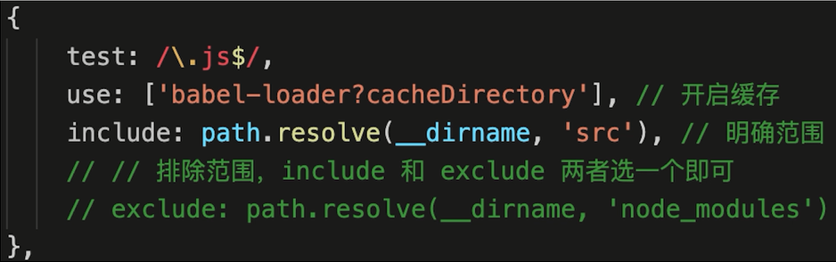

# Webpack

## webpack 基本配置

- 拆分配置和 merge
- 启动本地服务
- 处理 ES6
- 处理样式
- 处理图片
- （模块化）

## webpack 高级配置

- 多入口
- 抽离 CSS 文件
- 抽离公共代码
- 懒加载
- 处理 JSX
- 处理 Vue

## module chunk bundle 的区别

- module - 各个源码文件，webpack 中一切皆模块
- chunk - 多模块合并成的，如 entry import() splitChunk
- bundle - 最终的输出文件

## webpack 性能优化

- 优化打包构建速度 —— 开发体验和效率
- 优化产出代码 —— 产品性能

### 优化 babel

### IgnorePlugin 避免引入无用模块

- import moment from 'moment'
- 默认会引入所有语言 JS 代码，代码过大
- 如何只引入中文？
  

### noParse 避免重复打包

#### IgnorePlugin vs noParse

- IgnorePlugin 直接不引入，代码中没有
- noParse 引入，但不打包

### happyPack

- JS 单线程，开启多进程打包
- 提高构建速度（特别是多核 CPU）

### ParallelUglifyPlugin

- webpack 内置 Uglify 工具压缩 JS
- JS 单线程，开启多进程压缩更快
- 和 happyPack 同理

#### 关于开启多进程

- 项目较大，打包较慢，开启多进程能够提高速度
- 项目较小，打包很快，开启多进程会降低速度（进程也需要开销）
- 按需使用

### 自动刷新 VS 热更新

- 自动刷新：整个网页全部刷新，速度较慢，状态会丢失
- 热更新：新代码生效，网页不刷新，状态不丢失

### DllPlugin

- webpack 已内置 DllPlugin 支持
- DllPlugin - 打包出 dll 文件
- DllReferencePlugin - 使用 dll 文件

### webpack 优化构建速度（可用于生产环境）

- 优化 babel-loader
- IgnorePlugin
- noParse
- happyPack
- ParallelUglifyPlugin

### webpack 优化构建速度（不用于生产环境！）

- 自动刷新
- 热更新
- DllPlugin

### webpack 性能优化 - 产出代码

体积更小，合理分包，不重复加载，速度更快，内存使用更小

- 小图片 base64 编码
- bundle 加 hash
- 懒加载
- 提取公共代码
- IgnorePlugin
- 使用 CDN 加速
- 使用 production
  - 自动开启代码压缩
  - Vue React 等会自动删除调试代码（如开发环境的 warning）
  - 启动 Tree-Shaking - ES6 Module 才能让 tree-shaking 生效 - commonjs 就不行
    **ES6 Module 和 Commonjs 区别**
    - ES6 Module 静态引入，编译时引入
    - Commonjs 动态引入，执行时引入
    - 只有 ES6 Module 才能静态分析，实现 Tree-Shaking
      
- Scope Hosting
  - 代码体积更小
  - 创建函数作用域更少
  - 代码可读性更好
    

# babel

- 环境搭建&基本配置
- babel-polyfill（补丁）
  - 什么是 Polyfill
  - core-js 和 regenerator
  - babel-polyfill 即两者的集合
    - babel-polyfill 现已被弃用
    - 推荐直接使用 core-js 和 regenerator
    - 但并不影响面试会考察它
  - babel-polyfill 按需引入
    - 文件较大
    - 只有一部分功能，无需全部引入
    - 配置按需引入
      
- babel-runtime
  - babel-polyfill 的问题
    - 会污染全局环境
    - 如果做一个独立的 web 系统，则无碍
    - 如果做一个第三方 lib，则会有问题

## babel 环境搭建和基本配置

- 环境搭建
- .babelrc 配置
- presets 和 plugins

# 面试真题

1. 前端为何要进行打包和构建？

   - 代码层面
     - 体积更小（Tree-Shaking、压缩、合并），加载更快
     - 编译高级语言或语法（TS、ES6+、模块化、scss）
     - 兼容性和错误检查（Polyfill、postcss、eslint）
   - 前端工程化层面
     - 统一、高效的开发环境
     - 统一的构建流程和产出标准
     - 集成公司构建规范（提测、上线等）

2. module chunk bundle 的区别

   - module - 各个源码文件，webpack 中一切皆模块
   - chunk - 多模块合并成的，如 entry import() splitChunk
   - bundle - 最终的输出文件

3. loader 和 plugin 的区别

   - loader 模块转换器，如 less -> css
   - plugin 扩展插件，如 HtmlWebpackPlugin

4. 常见 loader 和 plugin 有哪些
   - 见 webpack 官网
5. babel 和 webpack 的区别
   - babel - JS 新语法编译工具，不关心模块化
   - webpack - 打包构建工具，是多个 loader plugin 的集合
6. 如何产出一个 lib
   - 参考 webpack.dll.js
   - output.lib
7. babel-polyfill 和 babel-runtime 的区别
   - babel-polyfill 会污染全局
   - babel-runtime 不会污染全局
   - 产出第三方 lib 要用 babel-runtime
8. webpack 如何实现懒加载
   - import()
   - 结合 Vue React 异步组件
   - 结合 Vue-router React-router 异步加载路由
9. 为何 Proxy 不能被 polyfill？
   - Proxy 的功能用 Object.definedProperty 无法模拟
